  

# Harsh Shelke

**ML Research Engineer @ Gmango AI Health**  
Realtime AI · LLM Systems · Evaluation · ML Engineering
📍 Bellevue, WA

---

 

## Overview

**Who I am.** ML research engineer focused on low-latency voice (WebSocket STT/TTS, semantic VAD) and measurable LLM systems (Langfuse, OpenTelemetry, Python).

**Building now.** Working on production AI and realtime voice systems, with a focus on performance, evaluation, observability, and reliability.

### Focus Areas

| Vector | What I work with | Why it matters |
| :--- | :--- | :--- |
| **Realtime AI** | STT/TTS · WebSockets · Semantic VAD · Audio Systems | Building responsive and reliable voice experiences |
| **AI Evaluation** | Python · Observability · Replay Testing · p50/p95/p99 | Making AI behavior measurable and reproducible |
| **LLM Research** | PyTorch · Transformers · LoRA / PEFT · RAG | Evaluating and improving model behavior |
---

 

## Key Impact @ Gmango AI Health

**ML Research Engineer · Jul 2026 – Present**

- Built stage-level latency instrumentation and percentile-based analysis to identify bottlenecks in realtime AI systems.
- Created a repeatable recording-based evaluation workflow to compare system behavior across changes and reproduce issues consistently.
- Improved realtime voice reliability through work on audio buffering, pause detection, and adaptive audio behavior.
- Investigated production AI failures, added regression coverage, and turned recurring issues into repeatable tests.
- Worked across AI evaluation, observability, debugging, and performance to make production systems more reliable.
---

 

## Education

| Degree | School | Timeline |
| :--- | :--- | :--- |
| **M.S. Computer Science** | University of Illinois at Chicago (UIC) | Aug 2024 – May 2026 |
| **B.Tech Computer Science & Engineering** | MIT World Peace University, Pune, India | Aug 2020 – Jun 2024 |

---

 

## Featured Projects

| Project | Stack | Impact |
| :--- | :--- | :--- |
| [**Travel-Safe**](https://github.com/harshelke180502/Travel-Safe) | Python · MCP · Anthropic Claude · FastAPI · React · Pydantic | Chicago travel-safety agent with **5** safety and transit tools; risk scoring over **3** live sources (crime, CTA, incidents) |
| [**M&A Intelligence Platform**](https://github.com/harshelke180502/ma-intelligence-platform) | Python · GPT-4o-mini · FastAPI · React · PostgreSQL · Vercel · Render | **7-stage** deal-sourcing pipeline; fine-tuned GPT-4o-mini on **100** labeled profiles to score **4,400+** acquisition targets 0–100% |
| [**LLM Allocation Harms**](https://github.com/harshelke180502/Allocation-Harms-in-LLMs) | Python · PyTorch · Transformers · PEFT/LoRA | LoRA on Llama-2 and Phi-3; **+0.12** demographic parity; **25%** better cross-group fairness (RABBI) across **7** demographic groups |
| [**Prompt2Pixel**](https://github.com/harshelke180502/Prompt2Pixel) | Python · FastAPI · HF Inference · SDXL · Ollama · Jinja2 | Multi-size / multi-image generation; local **gemma3:1b** prompt enhancement and validation before SDXL |
| [**Misinformation Detection**](https://github.com/harshelke180502/Misinformation-Analysis) | BERTopic · langdetect · Sentence Transformers | Multilingual RU/UA/EN pipeline over **5.9M+** YouTube comments; tracked **10** evolving narratives with cached translation batching |
| [**SAR Visualization**](https://github.com/harshelke180502/SAR-VISUALIZATION) | React · D3.js · Vite · Tailwind · Python · RDKit | Linked-view SAR explorer for **95** β-carboline antimalarial compounds; **15** scatter pairings plus a Tanimoto heatmap from Morgan fingerprints |

---

 

## Technical Stack

| Layer | Tools |
| :--- | :--- |
| **Languages** | Python · JavaScript · SQL · Java · C/C++ |
| **ML & LLMs** | PyTorch · TensorFlow · Transformers · LoRA / PEFT · Fine-tuning · Sentence Transformers · XGBoost · TabNet · LangChain |
| **Realtime AI** | STT · TTS · Semantic VAD · WebSocket Audio · Audio Streaming · Realtime AI |
| **Systems & Tooling** | FastAPI · Flask · React · Docker · Git · PostgreSQL · FAISS · D3.js · Hugging Face · Observability |
| **Evaluation & Metrics** | LangWatch replay harnesses · Benchmarking (p50 / p95 / p99) · TTFT / TTFA · Fairness (RABBI, demographic parity) · Precision / Recall · Cost-per-session |

---

 

## GitHub Analytics

Cards refresh on a daily GitHub Action. Stats and languages are stored in this repo so they keep rendering if a public host is down.

 

### Stats

  
  

 

### Streak

  

 

### Trophies

  

 

### Contributions

  

---

`hpshelke2002@gmail.com` · [linkedin.com/in/harsh-shelke](https://linkedin.com/in/harsh-shelke) · [github.com/harshelke180502](https://github.com/harshelke180502)

